# Introduksjon
Denne readme filen er ment som en en beskrivelse og rapport av Prosjektoppgave 2 i IKT205.

# Beskrivelse
Dette er en app av spillet TicTacToe (TrePåRad). 
Spillet baserer seg på to spillere som spiller mot hverandre og krysser av en av de 9 rutene med hver sin symbol, X og O.
Målet er å krysse av tre ruter slik at de havner på én rad - det gjelder horisontalt, vertikalt og diagonalt. 
Spillerne bytter på å gjøre et trekk, og første man til tre på rad vinner. 
Det hender av og til at ingen kan vinne på grunn av valgene til spillerne og da blir det uavgjort, og spillet startes på nytt. 

Alle disse funksjonalitetene er inkludert i denne appen.

# App
Spillet starter med at en spiller oppretter et spill som blir tilegnet sin egen GameId, noe som motstanderen 
bruker for å koble seg opp mot den spill instansen.

Når begge brukerne er koblet til spillinstansen, så blir navnene til spillerne vist på skjermen, og de starter å spille. 
Etter at de trykker på en rute, så blir ruten tildelt den spilleren sin symbol, X eller O.
Slik fortsetter spillet, og når en av spillerne får tre på rad på krysses det en rød linje gjennom den raden. 
Dersom spillet ender med uavgjort, så er det en knapp som starter et nytt spill som spillerne trykker på. 

**Spilleren starter et spill på følgende møte**  
Han trykker på *Start New Game* og skriver inn navnet sitt i vinduet, og trykker deretter på *Create*.
Dermed blir en spillinstanse opprettet, og navnet til spilleren blir vist, likedan med *GameId*-en til spillinstansen.

  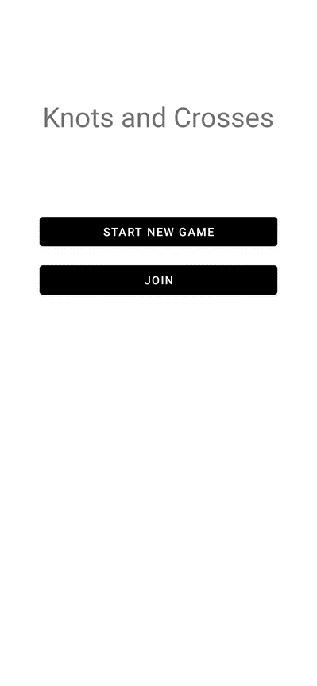
  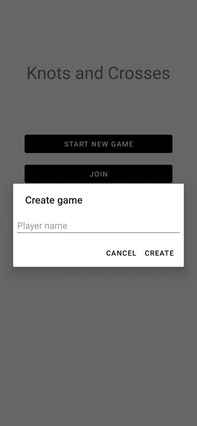 
  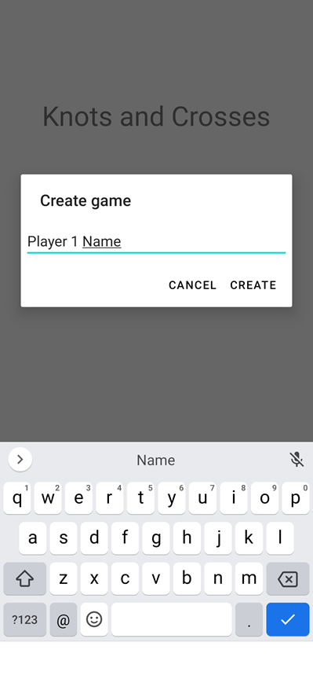
  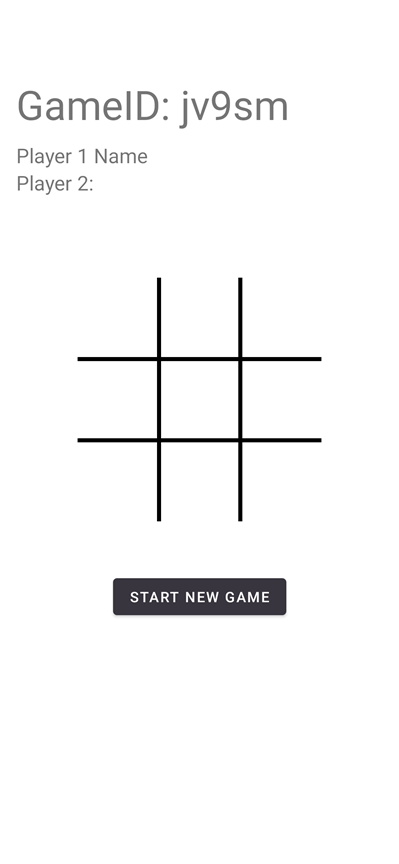

**Etter at en spiller har opprettet en spillinstanse så kan en annen spiller bli med i spillet.** 
For å bli med i spillet så trykker den andre spilleren på *Join*, skriver inn navnet sitt, GameId-en til spillinstansen og trykker deretter *Join*

  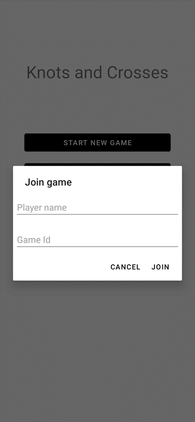
  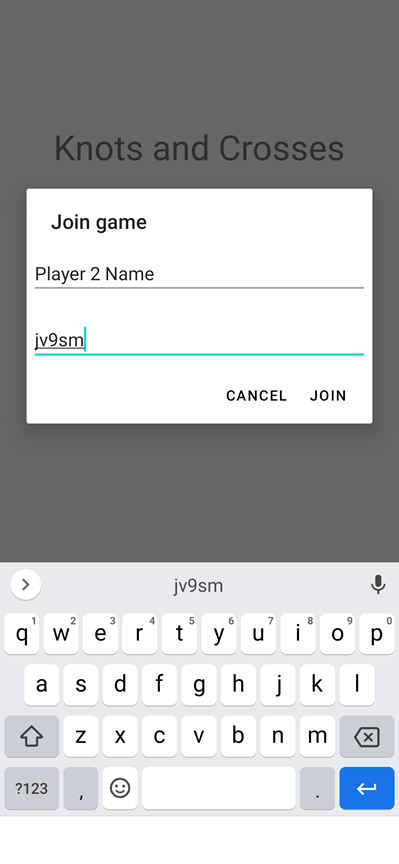 
  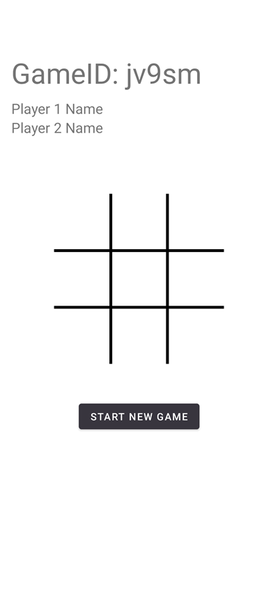

**Når begge spillerne er koblet til, så kan de spille mot hverandre, alt etter spillets regler.** 
Begge spillerne sine navn blir vist på skjermen, og lar spillerne vite begge er tilkoblet og klar for å spille.
De starter å spille, og den som opprettet spillet starter. 

  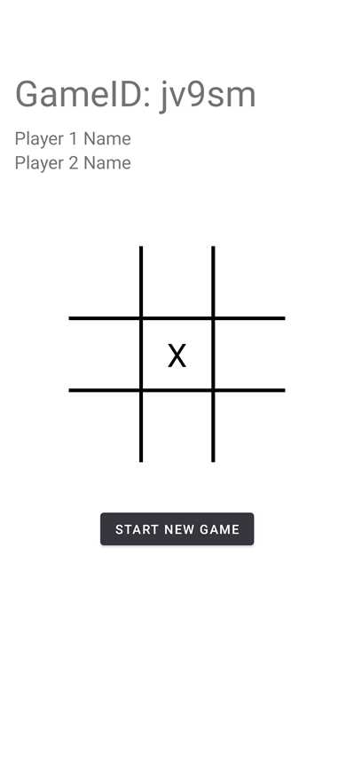
  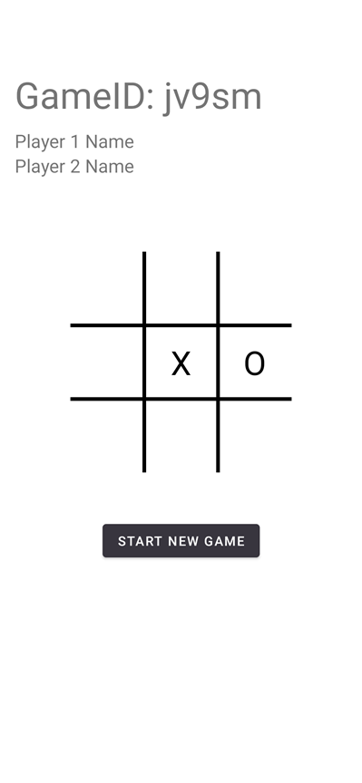 
  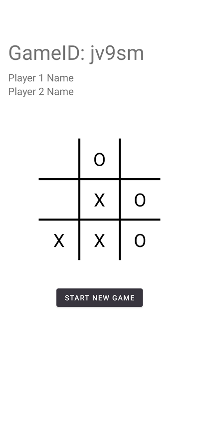

**Når en spiller vinner, så får vinneren en "You Won" tekst, og taperen får "You Lost".** 
Når spillet ender i et seier eller tap, så blir en linje trykket gjennom den raden som førte til seier/tap, akkuratt som i et vanlig TrePåRad spill.

  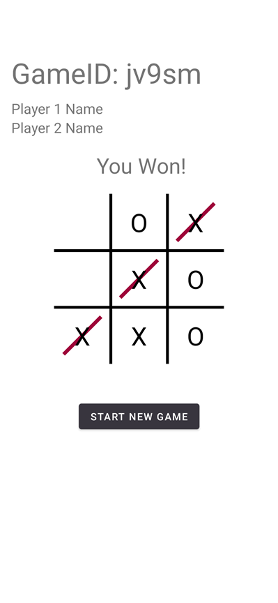
   

**Spillet er nå over, men dersom de ønsker å spille på nytt så kan de trykke på *"Start New Game"* knappen og starte på nytt.**

  

  

# Konklusjon
Som en konklusjon på denne rapporten, så vil jeg konkludere med å si at dette prosjektet har vært
en lærerik og utfordrende opplevelse. Spesielt nytt og litt utfordrende var oppkoblingen mot webtjenesten, men grunnet det så lærte
jeg veldig grunnleggende og nyttig kunnskap å ha for min egen fremtidig utvikling.

Som sluttresultat så har jeg lært å kode en helt fungerende TicTacToe app, og har fått god erfaring og kunnskap fra
denne prosjektoppgaven. 
